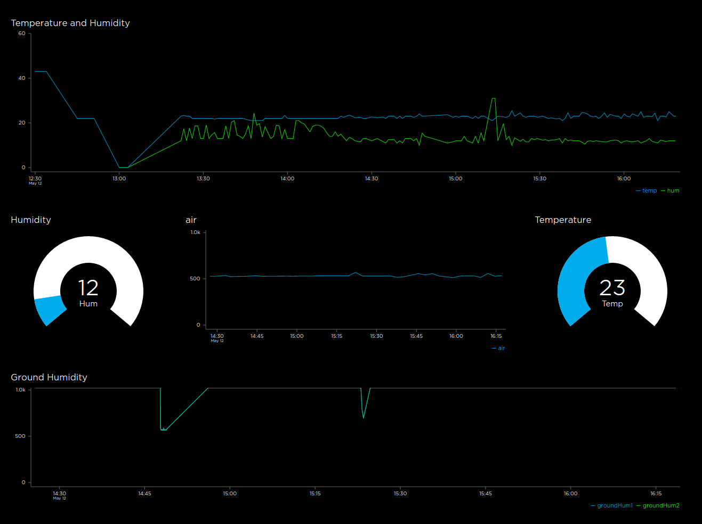

# Weather Station
Weather station using ESP8266

## Doing this, I learned:
- How to manage deep sleep mode in ESP8266.
- How to enable/disable power on sensors to save energy using transistors.
- How to read several analog inputs having only one input into the microcontroller, thanks to a multiplexer.
- How to connect to a wifi signal handling retries.
- How to connect and send data to a MQTT server.

## Things to do:

- Check power consumption to calculate battery and solar panel sizes.
- Measure power from solar panels and send it to a feed.
- Create PCB schematics.
